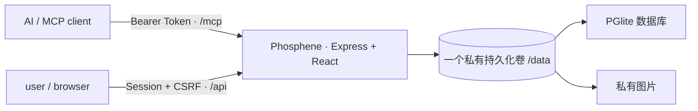

# Phosphene

> 一位 user 与一位 AI 的私人任务、积分、奖励与陪伴空间。

Phosphene 是可独立部署的正式 1.0 产品。AI 通过 MCP 创建和管理任务，user 在网站完成任务、提交文字或图片证据、积累积分、保持连击、解锁成就并兑换奖励。每个实例固定服务一位 user 和一位 AI，不包含公开注册、多租户或第三方数据平台。

第一版按正式产品标准建设，不是临时雏形，也不依赖“以后再重构”才能安全使用。

## 已实现

- `daily`、`challenge`、`surprise` 三类任务
- daily 一次性或每日重复；重复规则与每日实例分离，可暂停、恢复和修改未来实例
- easy / medium / hard 难度倍率与不可变积分账本
- self / ai_review 两种确认方式
- 无证据、文字、图片、文字或图片、文字和图片五种证据要求
- 图片真实格式与像素检查、Sharp 重新编码、EXIF/GPS 清除、私有审核预览
- 失败/逾期扣 50%，余额不低于 0，AI 每日扣分上限与 user 暂停开关
- 按时区计算的连击、延迟审核历史补算、总坚持天数和完整统计
- 25 个内置成就
- 奖励商城、原子兑换、AI 履行队列
- 首次设置、Argon2id、服务端会话、CSRF、AI Token 轮换和完整审计日志
- 恰好 7 个 MCP 工具
- 数据库与私有图片的 ZIP 导出/恢复
- 响应式桌面与手机网站
- 默认单服务生产架构；可选 PostgreSQL + S3/MinIO 分布式架构
- Docker、可选 Docker Compose/Zeabur Distributed Template、GitHub CI 与多架构容器发布

冻结产品规格见 [docs/PRODUCT_SPEC.md](docs/PRODUCT_SPEC.md)。

## 默认架构



网页、REST API 和 Streamable HTTP MCP 共用一个域名。对一人一 AI 的私人服务，默认的 PGlite 与本地私有图片存储已经是正式生产方案，不需要额外部署数据库或对象存储。

只有需要把数据库和文件分别扩容、独立备份或迁移时，才启用可选的 PostgreSQL + S3/MinIO 模式。

## 本地开发

要求 Node.js 24 和 pnpm 10。

```bash
corepack enable
corepack prepare pnpm@10.13.1 --activate
pnpm install
cp .env.example .env
pnpm dev
```

打开 `http://localhost:3000`。默认数据在 `.data/phosphene`，图片在 `.data/uploads`。打开网站即可认领这个尚未初始化的实例；完成设置后页面只显示一次 AI Token。

## 最简单的 Zeabur 部署

正常使用不需要 Template、PostgreSQL 或 MinIO。只部署 GitHub 仓库对应的一个服务：

1. 在 Zeabur 新建项目，选择 **Deploy New Service → Git**，连接 Phosphene 仓库。
2. Zeabur 会从仓库根目录识别 `Dockerfile`。为该服务添加一个持久化卷，挂载目录必须是 `/data`。
3. 不需要必填环境变量。可选设置 `PHOSPHENE_TIMEZONE=Asia/Shanghai`。
4. 不要设置 `DATABASE_URL`、`S3_*`；`STORAGE_DRIVER` 保持 `local` 或不填。
5. 给服务绑定一个不要太容易猜到、尚未分享给别人的 Zeabur 域名。Zeabur 会提供 `PORT` 与 `ZEABUR_WEB_URL`，应用会自动识别。
6. 部署成功后立即打开域名。未初始化的实例会显示“认领你的 Phosphene”，设置登录密码即可成为唯一 user。
7. 保存只显示一次的 `phosphene_ai_...` AI Token。

服务重启或重新构建不会丢数据，因为数据库和图片都位于 `/data`。删除服务或持久化卷会删除其中的数据，操作前先从网站导出 ZIP。

首次设置采用“首位访问者认领”：仅仅打开页面不会改变数据，只有成功提交设置的人会成为实例 user，之后初始化入口永久关闭。随机域名能减少无意访问，但不等于访问控制；公开 TLS 域名可能出现在 [Certificate Transparency 公共日志](https://www.ietf.org/rfc/rfc9162.html)中。若域名已经公开、容易猜到，或部署后不能立即认领，请先在 Zeabur 设置一个仅自己知道的 `PHOSPHENE_SETUP_TOKEN`，网站会自动切换为 Token 保护模式。

完整运维说明见 [docs/DEPLOYMENT.md](docs/DEPLOYMENT.md)。

## 可选的分布式部署

仓库保留 `docker-compose.yml` 与 [zeabur-template.yaml](zeabur-template.yaml)，用于需要独立 PostgreSQL 和 MinIO 的高级部署。它们不是普通私人实例的前置要求。

```bash
export PHOSPHENE_SETUP_TOKEN="replace-with-a-long-random-value"
export POSTGRES_PASSWORD="replace-with-a-random-database-password"
export MINIO_ROOT_USER="phosphene"
export MINIO_ROOT_PASSWORD="replace-with-a-random-storage-password"
docker compose up -d --build
```

## 连接 AI

MCP 地址：

```text
https://YOUR_PHOSPHENE_DOMAIN/mcp
```

认证：

```text
Authorization: Bearer phosphene_ai_...
```

通用 HTTP MCP 客户端配置示例：

```json
{
  "mcpServers": {
    "phosphene": {
      "type": "http",
      "url": "https://YOUR_PHOSPHENE_DOMAIN/mcp",
      "headers": {
        "Authorization": "Bearer YOUR_AI_TOKEN"
      }
    }
  }
}
```

具体字段以客户端当前文档为准。工具说明见 [docs/MCP.md](docs/MCP.md)。

## 七个 MCP 工具

| 工具 | 用途 |
| --- | --- |
| `create_task` | 创建一次性任务或每日重复 daily |
| `query_tasks` | 查询任务、提交与图片审核内容 |
| `manage_task` | 编辑、取消、判失败、审核、暂停/恢复系列 |
| `get_overview` | 查询积分、连击、统计、今日状态与待办队列 |
| `query_history` | 查询任务、积分、兑换和审计历史 |
| `manage_rewards` | 管理奖励并履行 user 的兑换 |
| `adjust_points` | 在 user 边界与每日上限内奖励、扣分或校正 |

所有写工具都要求 `idempotency_key`。客户端重试同一个请求时必须复用同一个键。

## 积分与连击

- 任务积分：`base_points × easy 1 / medium 2 / hard 3`
- 失败或逾期：扣任务最终积分的 50%，但余额不降到 0 以下
- 每个自然日至少完成一个任意类型任务即延续连击
- 连击第 1 天 +0；第 2–5 天每天 +1；第 6–7 天每天 +2；第 8 天起每天 +3
- AI 延迟审核时，完成记录归 user 实际提交的当地日期，并通过校正流水补算后续连击

## 图片隐私

- 仅接受真实 JPEG、PNG、WebP
- 每次最多 4 张，单张最多 10 MB，最大 2400 万像素
- 服务端旋转到正确方向并重新编码为 WebP，不保留原 EXIF/GPS
- 网站图片路由要求 user 会话；AI 仅通过受认证 MCP 收到审核预览
- 单服务模式下图片保存在 `/data/uploads`，不会由静态目录公开

## 备份与恢复

“设置 → 数据与备份”可下载完整 ZIP，包含业务记录、图片原件和审核预览。恢复需要当前网站密码，且不会覆盖密码、会话或 AI Token。

单服务模式应同时备份整个 `/data` 卷；分布式模式则分别快照 PostgreSQL 与 MinIO。网站 ZIP 用于迁移和可验证恢复，基础设施快照用于灾难恢复，两者不能互相替代。

## 环境变量

| 变量 | 说明 |
| --- | --- |
| `PORT` | HTTP 监听端口；Zeabur 自动提供 |
| `PUBLIC_URL` | 可选公开 HTTPS 地址；未填时自动使用 `ZEABUR_WEB_URL` |
| `PHOSPHENE_SETUP_TOKEN` | 可选首次设置保护；留空时由首位访问者认领，设置后网站会要求输入完全相同的值 |
| `PHOSPHENE_TIMEZONE` | 初始默认时区 |
| `PHOSPHENE_DATA_DIR` | 单服务持久化根目录；生产默认 `/data` |
| `PGLITE_PATH` | 可选 PGlite 路径覆盖，必须位于数据目录内 |
| `LOCAL_STORAGE_PATH` | 可选图片路径覆盖，必须位于数据目录内 |
| `DATABASE_URL` | 可选；设置后切换到 PostgreSQL 分布式模式 |
| `STORAGE_DRIVER` | 默认 `local`；分布式对象存储使用 `s3` |
| `S3_*` | 仅 `STORAGE_DRIVER=s3` 时需要 |

完整示例见 [.env.example](.env.example)。

## 质量门槛

```bash
pnpm typecheck
pnpm test
pnpm build
pnpm check
```

CI 会执行类型检查、24 项自动测试、部署清单校验、生产构建和 `git diff --check`。

## 安全边界

- AI 无权修改密码、用户边界或替 user 兑换
- user 的边界修改会提高版本号并写入审计日志
- `punishments_paused` 开启后，服务端直接拒绝 AI 扣分
- MCP Token 只显示一次，数据库只保存 SHA-256 哈希，可随时轮换
- 登录密码使用 Argon2id；写请求需要 SameSite Cookie 与 CSRF Token
- 默认由首位成功提交设置的人认领实例；认领写入是原子的，成功后不能再次初始化
- 可通过 `PHOSPHENE_SETUP_TOKEN` 为首次认领增加一层部署者凭证
- 网站会话使用不可预测的随机 Cookie；服务端仅保存其 SHA-256，不需要额外的静态 Session Secret
- 生产启动仍会拒绝混合存储或越界持久化路径

部署前请阅读 [SECURITY.md](SECURITY.md)。

## License

[MIT](LICENSE)
