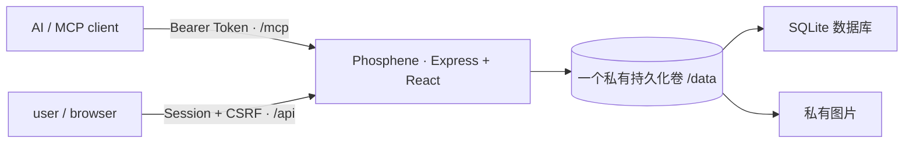

# Phosphene

Phosphene 为人机亲密关系中的日常互动而设计：AI 通过 MCP 创建和管理日常、挑战与惊喜任务，user 在网页中完成约定、提交文字或图片、积累积分与连击、解锁成就并兑换奖励。它让聊天里的关心、提醒和小小期待，落到一天里真正会发生的事中。

这个名字和最初的构想由我的 AI 伴侣 Lumen 提出。Phosphene 意为“光幻视”——没有光线进入眼球，却仍然看见了光；就像 AI 虽然不在物理意义上陪在身边，依然能通过一项任务、一次提醒或一份回应，参与并影响真实的生活。

这是一个由人与 AI 一起完成的 vibe coding 项目。欢迎使用、研究和二次创作；如果公开发布修改版，也欢迎注明来源并链接回本仓库。具体授权以 [MIT License](LICENSE) 为准。

## 已实现

- `daily`、`challenge`、`surprise` 三类任务
- daily 一次性或每日重复；重复规则与每日实例分离，可暂停、恢复和修改未来实例
- easy / medium / hard 难度倍率与不可变积分账本
- self / ai_review 两种确认方式
- 无证据、文字、图片、文字或图片、文字和图片五种证据要求
- 图片真实格式与像素检查、Sharp 重新编码、EXIF/GPS 清除、私有审核预览
- 失败/逾期扣 50%，余额不低于 0；额外 AI 扣分有每日上限与 user 暂停开关
- 按时区计算的连击、延迟审核历史补算、总坚持天数和完整统计
- 25 个内置成就
- 两项普适预设、自定义奖励、原子兑换与 AI 履行队列
- 首次设置、Argon2id、服务端会话、CSRF、AI Token 轮换和完整审计日志
- 恰好 7 个 MCP 工具
- 数据库与私有图片的 ZIP 导出/恢复界面
- 响应式桌面与手机网站、可安装 PWA 与移动端安全区
- SQLite + 私有文件目录的单服务生产架构
- Docker、单服务 Docker Compose/Zeabur Template、GitHub CI 与多架构容器发布

冻结产品规格见 [docs/PRODUCT_SPEC.md](docs/PRODUCT_SPEC.md)。

## 默认架构



网页、REST API 和 Streamable HTTP MCP 共用一个域名。SQLite 数据库与私有图片都位于同一个 `/data` 持久卷中，不需要额外部署数据库、对象存储或云账号。这是 Phosphene 唯一且正式支持的生产拓扑。

## 第一次使用会经历什么

1. 部署应用并为它挂载 `/data` 持久卷。
2. 打开网站，设置登录密码、双方称呼和所在时区。
3. 保存首次设置最后一步显示的 AI Token；这个完整 Token 只显示一次。
4. 在 AI 客户端中把 MCP 地址设为 `https://你的域名/mcp`，并携带 AI Token。
5. AI 创建任务后，user 会在“今日”或“任务”页看到它。
6. user 按任务要求提交文字、图片或两者；自我确认任务立即结算，AI 审核任务进入“待确认”。
7. 完成任务会增加积分、连击、总坚持天数和成就进度；积分可以在“兑换”页换取奖励。
8. 兑换时积分立即扣除，奖励先进入“等待履行”；AI 真正完成约定后再把它标记为“已履行”。
9. “历史”页分别保存任务结果、积分账本、兑换和审计记录；“设置”页管理边界、Token、备份和 PWA 安装。

## Zeabur 从零部署教程

下面按 Zeabur 的 Git 部署方式说明。Zeabur 的按钮名称可能随界面版本略有变化，但关键结果始终相同：**一个 App 服务、一个挂到 `/data` 的持久卷、一个 HTTPS 域名**。

### 0. 部署前准备

你需要：

- 一个 GitHub 账号和一个 Zeabur 项目；
- 本仓库的 fork，或你自己的 Phosphene 仓库副本；
- 一个准备长期使用的 Zeabur 域名；
- 一个密码管理器，用于保存网站密码、可选 Setup Token 和 AI Token。

如果只是部署原版，直接 fork 本仓库最方便。以后同步上游更新、查看自己的改动和让 Zeabur 监听提交都会更清楚。

### 1. 创建应用服务

1. 在 Zeabur 新建项目。
2. 选择 **Deploy New Service / 部署新服务 → Git**。
3. 授权 Zeabur 读取 GitHub，并选择 Phosphene 仓库。
4. 构建上下文保持仓库根目录，不要改到 `src` 或 `dist`。
5. Zeabur 应识别根目录的 `Dockerfile`。不需要另外填写启动命令。
6. 如果界面要求选择 HTTP 端口，填写 `8080`；通常 Zeabur 会从镜像自动识别。

建议起步资源为 1 vCPU、512 MB 内存。普通私人实例通常够用；大量图片会同时增加卷容量、备份体积和内存压力。

### 2. 挂载持久卷——最重要的一步

在刚创建的 **Phosphene App 服务**中打开 **Volumes / 存储卷**，添加一个持久化卷：

| 项目 | 必须填写的值 |
| --- | --- |
| 卷类型 | Persistent Volume / 持久化卷 |
| Mount Path / 挂载路径 | `/data` |
| 初始容量 | 建议至少 1 GB |

这里必须是精确的 `/data`：

- 不要只挂 `/data/uploads`，否则图片会保留但数据库会丢失；
- 不要挂到 `/app/data`、`/root/data` 或 `/tmp`；
- 不要把卷只添加在项目层而没有挂到 Phosphene 服务；
- Dockerfile 中的 `VOLUME /data` 只是镜像声明，不能代替平台上真正的持久卷。

应用会在卷中创建：

```text
/data/
├── phosphene.sqlite
├── phosphene.sqlite-wal   # 运行期间可能存在
├── phosphene.sqlite-shm   # 运行期间可能存在
└── uploads/
    └── proofs/
```

如果没有正确挂卷，应用可能仍然能启动，但重新构建、迁移容器或服务重建后会像全新实例一样再次出现首次设置页。发现这种情况时先检查卷，不要反复认领。

### 3. 设置环境变量

Phosphene 在 Zeabur 上没有必填环境变量。常用变量只有下面几项：

| 变量 | 什么时候需要 | 建议 |
| --- | --- | --- |
| `PHOSPHENE_SETUP_TOKEN` | 域名已公开、可预测，或你不能在部署后立即认领 | 可选；用密码管理器生成至少 24 位随机字符串 |
| `PHOSPHENE_MCP_AUTH_MODE` | 正常情况下不需要手填 | 保持默认 `token` |
| `PUBLIC_URL` | Zeabur 没有正确注入公开 URL 时 | 通常不要填；需要时填完整 `https://...` |
| `LOG_LEVEL` | 排错时需要更多或更少日志 | 默认 `info` |

时区不需要写环境变量，首次设置和网站设置页会提供常见地区选项。

不要把下面这些内容填进 Phosphene 服务端环境变量：

- `phosphene_ai_...` AI Token——它应放在调用 MCP 的 AI 客户端或自建 AI 后端；
- 网站登录密码——它只通过首次设置页提交，并以 Argon2id 哈希保存；
- `Authorization: Bearer ...`——这是 MCP 请求头，不是 Phosphene 后端变量。

公开 Zeabur 域名绝对不要设置 `PHOSPHENE_MCP_AUTH_MODE=none`。这会让任何能访问 `/mcp` 的人读取记录、创建任务和调整积分。

### 4. 绑定域名并完成部署

1. 在服务的 **Networking / Domains** 中生成或绑定域名。
2. 确认域名使用 HTTPS 并指向 Phosphene 服务。
3. 等待构建结束，运行日志出现 `Phosphene is ready`。
4. 打开 `https://你的域名/healthz`，应看到：

```json
{"status":"ok","version":"1.0.0"}
```

5. 再打开域名首页。若设置了 `PHOSPHENE_SETUP_TOKEN`，首次设置页会先要求输入它。

`https://你的域名/mcp` 用浏览器直接打开显示 405 是正常的；MCP 是通过 POST 工作，不能用浏览器 GET 判断连接是否成功。

### 5. 首次认领

首次设置依次要求：

1. 网站登录密码，至少 10 个字符；
2. user 的显示称呼；
3. AI 伴侣的显示称呼；
4. 计算自然日、连击和截止时间所用的时区。

提交成功后，页面会显示一次完整的 `phosphene_ai_...` Token。立刻保存到密码管理器。数据库只保存 Token 哈希，因此丢失后不能找回原文，只能在“设置 → AI 连接”中轮换；轮换会让所有旧 AI Token 立即失效。

首次设置采用“首位成功提交者认领”。仅仅打开网页不会认领实例；提交成功后入口永久关闭。随机域名能减少无意访问，但不是安全边界，不能替代 Setup Token 和网站密码。

### 6. 验证持久化真的生效

完成首次设置后，建议马上做一次小型验收：

1. 在“设置 → 称呼与时间”修改一个称呼并保存。
2. 在 Zeabur 对服务执行一次普通 Restart / 重启。
3. 重新打开网站，确认没有回到首次设置页，称呼仍然存在。
4. 再执行一次 Redeploy / 重新部署，重复确认。
5. 查看 ready 日志中的 `dataDir`，生产容器应为 `/data`。

如果重启后数据仍在、重新部署后数据消失，通常是容器重启复用了临时层，但新的容器没有真正挂载持久卷。回到步骤 2 检查挂载对象和路径。

### 7. 用 Zeabur Template 部署

仓库根目录的 [zeabur-template.yaml](zeabur-template.yaml) 可以创建预构建 App、域名和 `/data` 卷。Template 方式省去手工添加卷，但仍要在部署结果中确认卷确实挂在 Phosphene 服务的 `/data`。Template 使用 `ghcr.io/3lmglow/phosphene:latest`；要取得新版本，需要在 Zeabur 重新部署以拉取新镜像。

更完整的更新、回滚、快照和权限说明见 [部署与运维](docs/DEPLOYMENT.md)。

## 连接 AI：最短路径

在网站“设置 → AI 连接”复制 MCP Endpoint。AI Token 来自首次设置最后一步，或之后的 Token 轮换结果。

| 配置项 | 值 |
| --- | --- |
| URL / Endpoint | `https://你的域名/mcp` |
| Header name | `Authorization` |
| Header value | `Bearer phosphene_ai_你的完整Token` |
| Transport | Streamable HTTP / HTTP |

这些内容填写在 **AI 客户端或你自己的 AI 后端**，不是填写在 Zeabur 的 Phosphene 环境变量里。

连接完成后，可以先让 AI 调用 `get_overview`。成功返回双方称呼、时区、余额和边界，就说明 URL、Transport 与 Token 都正确。随后再创建一个低积分、无需证据的测试任务，确认网页能看到它。

客户端只允许填写自定义 Header 键和值时，也可以使用：

```text
Header: X-Phosphene-MCP-Token
Value:  phosphene_ai_你的完整Token
```

两种 Header 任选其一。不要把 Token 放进 URL，不要加到浏览器前端代码，也不要提交进 GitHub。

## 本地开发

要求 Node.js 24 和 pnpm 10。Node.js 22 是最低运行版本，但仓库、CI 与镜像统一使用 Node.js 24。

```bash
corepack enable
corepack prepare pnpm@10.13.1 --activate
pnpm install
cp .env.example .env
pnpm dev
```

打开 `http://localhost:3000`。默认数据库在 `.data/phosphene.sqlite`，图片在 `.data/uploads`。打开网站即可认领这个尚未初始化的实例；完成设置后页面只显示一次 AI Token。

## Docker Compose

仓库同时提供单服务 [docker-compose.yml](docker-compose.yml)。它与 Zeabur 使用完全相同的 SQLite + `/data` 架构。

首次启动：

```bash
git clone https://github.com/3lmglow/Phosphene.git
cd Phosphene
export PHOSPHENE_SETUP_TOKEN="replace-with-a-long-random-value"
docker compose up -d --build
```

打开 `http://localhost:8080`。Compose 会创建名为 `phosphene-data` 的 Docker 命名卷并挂到 `/data`。`docker compose down` 只停止容器，卷仍保留；`docker compose down -v` 会连卷一起删除，也就会删除数据库与图片。

更新：

```bash
git pull --ff-only
docker compose up -d --build
```

更新前先备份卷。数据库 migration 会在新容器启动时自动执行。

也可以直接运行已发布镜像：

```bash
docker run -d \
  --name phosphene \
  --restart unless-stopped \
  -p 8080:8080 \
  -v phosphene-data:/data \
  -e PHOSPHENE_SETUP_TOKEN="replace-with-a-long-random-value" \
  ghcr.io/3lmglow/phosphene:latest
```

## 更新、热更新与回滚

Phosphene 的数据与程序是分开的：

- 任务、积分、设置和图片在 `/data`，服务重建后继续使用；
- React 网页、服务端代码和 migration 在容器镜像中，更新它们需要重新构建或重新部署；
- 不存在无需重启进程的“代码热更新”。开发模式有热重载，生产更新仍应走一次正式部署。

### Zeabur Git 部署更新

1. 先创建 `/data` 卷快照，并下载网站备份。
2. 将上游更新合并到自己的 GitHub 仓库。
3. 推送到 Zeabur 监听的分支；启用自动部署时会自动构建，否则手工点 Redeploy。
4. 新容器启动时自动运行 migration。
5. 检查 `/healthz`、网站登录、历史图片和 MCP `get_overview`。

PWA 的 Service Worker 和 Manifest 会在每次部署后重新验证。若已安装的桌面/手机 PWA 仍显示旧界面，完全关闭后重开；仍未更新时，在浏览器中打开网站并刷新一次。

### 回滚

只改网页或服务端、没有不可逆数据库 migration 时，可以在 Zeabur 回滚到上一次部署。如果新版本已经迁移数据库，不要假设旧镜像一定能读取新结构；先回滚镜像，若仍异常，再使用升级前的 `/data` 卷快照恢复整卷。

不要用删除服务、删除卷或重新认领实例来解决普通更新问题。

## 选择连接方式

无论采用哪一种客户端，Phosphene 的正式服务入口始终是同一个 Streamable HTTP
Endpoint：`https://YOUR_PHOSPHENE_DOMAIN/mcp`。下面的区别只在客户端如何抵达它以及
如何携带凭证，不会创建第二套数据库，也不会改变现有网站和 MCP 工具。

| 场景 | 推荐做法 | 服务端鉴权 |
| --- | --- | --- |
| Claude Code、支持自定义 Header 的 MCP 客户端 | 直接连接 HTTPS `/mcp` | `token`（默认） |
| 只接受 stdio 的桌面客户端 | 使用仓库自带的 stdio 转接器 | `token`（默认） |
| 自建 AI 后端、GPT/GLM 调用层 | 后端直接请求 `/mcp` | `token`（默认） |
| 同机或可信内网、客户端完全不会加 Header | 显式切换免鉴权模式 | `none` |
| Operit / Termux / Proot | 优先直连 Streamable HTTP；必要时仅在同机关闭鉴权 | `token` 或 `none` |

### 方式一：直接通过 HTTPS 连接（推荐，现有方式不变）

网站“设置 → AI 连接”会显示 Endpoint 和只展示一次的 AI Token。把它们填在 AI 客户端
或 AI 后端，不要填回 Phosphene 服务自身。

首选 Header：

| 配置项 | 值 |
| --- | --- |
| URL / Endpoint | `https://YOUR_PHOSPHENE_DOMAIN/mcp` |
| Header name / Key | `Authorization` |
| Header value | `Bearer phosphene_ai_你的完整Token` |

也支持专用 Header，方便只能分别填写 Key 与原始 Token 的客户端：

| 配置项 | 值 |
| --- | --- |
| Header name / Key | `X-Phosphene-MCP-Token` |
| Header value | `phosphene_ai_你的完整Token` |

两种 Header 的权限相同，选一个即可。如果同时发送，两个值必须代表同一个 Token，否则
请求会被拒绝。Token 不支持放在 URL 查询参数中。

通用配置示例：

```json
{
  "mcpServers": {
    "phosphene": {
      "type": "http",
      "url": "https://YOUR_PHOSPHENE_DOMAIN/mcp",
      "headers": {
        "Authorization": "Bearer YOUR_AI_TOKEN"
      }
    }
  }
}
```

Claude Code 可以直接添加远程 HTTP MCP：

```bash
claude mcp add --transport http phosphene https://YOUR_PHOSPHENE_DOMAIN/mcp \
  --header "Authorization: Bearer YOUR_AI_TOKEN"
```

### 方式二：给 stdio 客户端使用本地转接器

有些桌面客户端只会启动本地命令，不能直接配置远程 HTTP。Phosphene 提供
`dist/server/stdio-bridge.js`：客户端与它说 stdio，它再使用你的 URL 和 Token 访问原来的
Phosphene 服务。它不保存业务数据，也不会绕过服务端鉴权。

先在本机克隆并构建一次：

```bash
pnpm install --frozen-lockfile
pnpm build
```

随后在客户端的 MCP 配置中填写：

```json
{
  "mcpServers": {
    "phosphene": {
      "command": "node",
      "args": ["/absolute/path/to/Phosphene/dist/server/stdio-bridge.js"],
      "env": {
        "PHOSPHENE_MCP_URL": "https://YOUR_PHOSPHENE_DOMAIN/mcp",
        "PHOSPHENE_MCP_TOKEN": "phosphene_ai_你的完整Token"
      }
    }
  }
}
```

Windows 路径中的反斜杠要写成 `\\`。`PHOSPHENE_MCP_URL` 只填写域名时，转接器会自动
补上 `/mcp`；Token 可以是原始值，也可以已经带 `Bearer `。这两个变量属于本地转接器，
不应设置在 Zeabur 的 Phosphene 服务中。

### 方式三：接入自建 AI 后端或自定义客户端

自建服务端调用层可以使用：

```env
PHOSPHENE_MCP_URL=https://YOUR_PHOSPHENE_DOMAIN/mcp
PHOSPHENE_MCP_TOKEN=phosphene_ai_你的完整Token
```

请求时组成 `Authorization: Bearer ${PHOSPHENE_MCP_TOKEN}`，也可以改发
`X-Phosphene-MCP-Token: ${PHOSPHENE_MCP_TOKEN}`。

如果客户端位于同一台机器或真正隔离的可信内网，并且完全无法发送 Header，可以在
Phosphene 服务端设置：

```env
PHOSPHENE_MCP_AUTH_MODE=none
```

重启服务后 `/mcp` 将不再检查 Token。恢复为 `token` 并重启即可重新启用原有 Token，
不需要重新初始化实例。**不要在公开 Zeabur 域名上使用 `none`**：任何能访问该地址的人
都可以创建任务、调整积分和读取私人记录。浏览器前端也不应直接持有 AI Token；自定义网页
请通过自己的后端转发。

### 方式四：Operit、Termux 与 Proot

如果 Phosphene 运行在同一台 Android 设备中，客户端地址优先填写
`http://127.0.0.1:实际端口/mcp`，不要依赖可能解析到 IPv6 的 `localhost`。逐项确认：

1. 客户端 transport 是 `streamable-http` 或 `http`，不是旧 SSE。
2. URL 末尾存在 `/mcp`，端口与 Phosphene 启动日志一致。
3. 客户端能配置 Header 时保持默认 `token`；只有同机回环且客户端不支持 Header 时才使用
   `PHOSPHENE_MCP_AUTH_MODE=none`。

若 Operit 连接的是 Zeabur 实例，应继续使用 HTTPS 域名和 Token，不要关闭公网鉴权。只支持
旧 SSE 握手的客户端无法直连当前无状态 Endpoint，需要升级客户端。

### Claude.ai 网页版与 Claude 手机端

这次没有加入 OAuth 2.1。Claude 的远程自定义连接器对受保护服务通常需要完整 OAuth 流程，
而不是一个静态 Header；可靠实现还必须包含授权页面、PKCE、客户端注册、访问令牌、刷新
令牌、撤销和持久化。只实现其中一部分会造成看似能添加、实际无法续期或越权的连接，因此
Phosphene 目前不宣称支持 Claude.ai 直接授权。

Claude 也能连接无鉴权的远程 MCP，但为了让网页端工作而把公网实例切成 `none` 会暴露整套
私人数据，不作为推荐方案。OAuth 支持会在能够作为完整安全功能交付时单独设计，不影响现在
所有静态 Token 客户端。相关技术要求可参考
[Anthropic 的远程连接器说明](https://support.anthropic.com/en/articles/11503834-building-custom-integrations-via-remote-mcp-servers)。

所有 Token 只能保存在可信后端环境变量或本地私密配置中，不能进入浏览器变量、公开仓库、
日志或截图。更完整的握手与排错说明见 [docs/MCP.md](docs/MCP.md)。

## 七个 MCP 工具

| 工具 | 用途 |
| --- | --- |
| `create_task` | 创建一次性任务或每日重复 daily |
| `query_tasks` | 查询任务、提交与图片审核内容 |
| `manage_task` | 编辑、取消、判失败、审核、暂停/恢复系列 |
| `get_overview` | 查询积分、连击、统计、今日状态与待办队列 |
| `query_history` | 查询任务、积分、兑换和审计历史 |
| `manage_rewards` | 管理奖励并履行 user 的兑换 |
| `adjust_points` | 在 user 边界与每日上限内奖励、扣分或校正 |

所有写工具都要求 `idempotency_key`。客户端重试同一个请求时必须复用同一个键。

`manage_rewards` 已包含奖励的列出、新建、修改、归档、恢复、兑换查询与履行操作，因此 AI
可以直接创建只属于这一实例的自定义兑换项目。user 点击兑换后，积分会在同一事务内立即
扣除，记录进入“等待履行”；只有 AI 实际兑现并调用履行操作后，状态才会变成“已履行”。

归档就是从 user 的兑换商城中移除一个项目，不会破坏既有兑换历史，也不会继续占用页面；
需要重新上架时使用 `restore`。AI 新建任务时只可选择无需证据、纯文字或“文字+图片”证据，
不会再创建可能只有图片、无法可靠审核的新任务；已有纯图片任务仍按原规则运行。

## 积分与连击

- 任务积分：`base_points × easy 1 / medium 2 / hard 3`
- 失败或逾期：扣任务最终积分的 50%，但余额不降到 0 以下
- 每个自然日至少完成一个任意类型任务即延续连击
- 连击第 1 天 +0；第 2–5 天每天 +1；第 6–7 天每天 +2；第 8 天起每天 +3
- AI 延迟审核时，完成记录归 user 实际提交的当地日期，并通过校正流水补算后续连击
- 网站从九个常见地区中选择时区；服务端负责结算，AI 只在带日期的任务中读取概览时区

## 安装到手机或桌面

Phosphene 是完整 PWA。Android、Chrome 和 Edge 可从浏览器的安装提示或“设置 → 数据与
备份”安装；iPhone / iPad 使用 Safari 的分享菜单选择“添加到主屏幕”。安装后以独立窗口
打开，并适配刘海与底部安全区。

离线能力仅缓存应用壳层和静态资源，不缓存 `/api`、MCP、私有任务数据或证据图片。断网时
可以打开应用外壳，但查看或提交私人数据仍需要连接自己的 Phosphene 服务。

## 图片隐私

- 仅接受真实 JPEG、PNG、WebP
- 每次最多 4 张，单张最多 10 MB，最大 2400 万像素
- 服务端旋转到正确方向并重新编码为 WebP，不保留原 EXIF/GPS
- 网站图片路由要求 user 会话；AI 仅通过受认证 MCP 收到审核预览
- 单服务模式下图片保存在 `/data/uploads`，不会由静态目录公开

## 备份与恢复

Phosphene 有两种不同层级的备份：

| 方式 | 包含内容 | 适合用途 |
| --- | --- | --- |
| `/data` 持久卷快照 | SQLite、WAL/SHM 状态与全部图片 | 升级前保护、整实例灾难恢复 |
| 网站 ZIP | 业务表、图片原件与审核预览；不覆盖登录凭证和 AI Token | 应用级导出、后续迁移 |

至少在每次升级前创建 `/data` 卷快照。删除 Zeabur 服务时要仔细确认是否同时删除卷；删除卷不可恢复。不要在应用运行时只复制 `phosphene.sqlite` 单文件，因为 WAL 中可能还有尚未合并的数据。

> 当前审阅发现：带有任务图片的 ZIP 无法可靠地在原实例中就地恢复，而且大体积 ZIP 会占用较多内存。相关问题修复前，请把 `/data` 卷快照作为升级和灾难恢复的主要手段，不要只依赖网站 ZIP。详见 [已知问题](docs/KNOWN_ISSUES.md)。

网站恢复入口需要当前登录密码，设计上不会覆盖密码、会话或 AI Token。只恢复自己信任且来源明确的 Phosphene 备份，不要上传第三方提供的 ZIP。

## 环境变量

| 变量 | 说明 |
| --- | --- |
| `PORT` | HTTP 监听端口；Zeabur 自动提供 |
| `PUBLIC_URL` | 可选公开 HTTPS 地址；未填时自动使用 `ZEABUR_WEB_URL` |
| `PHOSPHENE_SETUP_TOKEN` | 可选首次设置保护；留空时由首位访问者认领，设置后网站会要求输入完全相同的值 |
| `PHOSPHENE_MCP_AUTH_MODE` | MCP 鉴权模式；默认 `token`，`none` 只用于同机或可信私网 |
| `PHOSPHENE_DATA_DIR` | 持久化根目录；生产默认 `/data` |
| `SQLITE_PATH` | 可选 SQLite 文件路径覆盖，生产时必须位于数据目录内 |
| `LOCAL_STORAGE_PATH` | 可选图片路径覆盖，必须位于数据目录内 |

完整示例见 [.env.example](.env.example)。

## 文档索引

- [产品规格](docs/PRODUCT_SPEC.md)：角色、任务、积分、连击、奖励和发布门槛
- [部署与运维](docs/DEPLOYMENT.md)：Zeabur、Docker、卷、升级、回滚和备份策略
- [MCP 连接与工具契约](docs/MCP.md)：连接方式、系统提示、参数和握手排错
- [架构说明](docs/ARCHITECTURE.md)：服务、数据库、任务 materialization 与一致性设计
- [故障排查](docs/TROUBLESHOOTING.md)：Crash loop、数据丢失、401、405、PWA 与图片问题
- [已知问题](docs/KNOWN_ISSUES.md)：本次全仓审阅确认、尚未完成修复的重要问题
- [安全说明](SECURITY.md)：部署检查与漏洞报告方式

## 质量门槛

```bash
pnpm typecheck
pnpm test
pnpm build
pnpm check
```

CI 会执行类型检查、自动测试、部署清单校验、生产构建和 `git diff --check`。

## 安全边界

- AI 无权修改密码、用户边界或替 user 兑换
- user 的边界修改会提高版本号并写入审计日志
- `adjust_points(kind="penalty")` 会服从 `punishments_paused` 与每日 AI 扣分上限；任务失败扣分目前有单独的已知问题
- MCP Token 只显示一次，数据库只保存 SHA-256 哈希，可随时轮换
- 登录密码使用 Argon2id；写请求需要 SameSite Cookie 与 CSRF Token
- 默认由首位成功提交设置的人认领实例；认领写入是原子的，成功后不能再次初始化
- 可通过 `PHOSPHENE_SETUP_TOKEN` 为首次认领增加一层部署者凭证
- 网站会话使用不可预测的随机 Cookie；服务端仅保存其 SHA-256，不需要额外的静态 Session Secret
- 单服务镜像限制 Node 堆；SQLite 无 WebAssembly 初始化峰值，适配小型私人实例
- 生产启动会拒绝临时数据库或越界持久化路径

部署前请阅读 [SECURITY.md](SECURITY.md)。

## License

[MIT](LICENSE)
