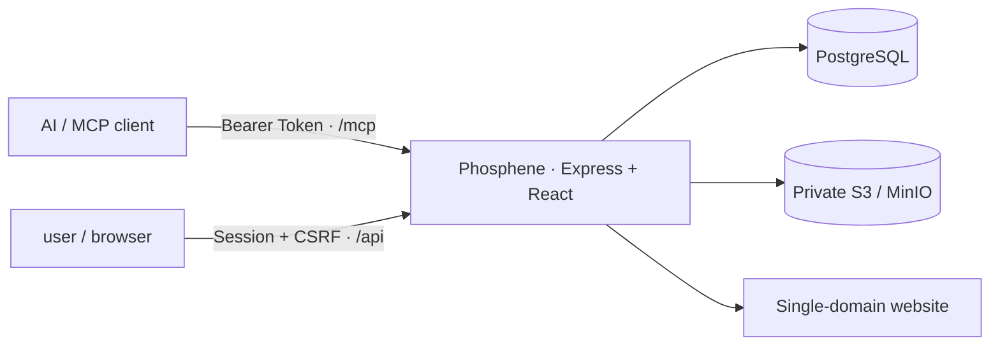

# Phosphene

> 一位 user 与一位 AI 的私人任务、积分、奖励与陪伴空间。

Phosphene 是可独立部署的正式 1.0 产品：AI 通过 MCP 创建和管理任务，user 在网站完成任务、
提交文字或图片证据、累积积分、保持连击、解锁成就并兑换奖励。每个实例只有一位 user 和一位
AI，没有公开注册、多租户或第三方数据平台。

## 已实现

- `daily`、`challenge`、`surprise` 三类任务
- daily 一次性或每日重复；规则与每日实例分离，支持暂停、恢复和修改未来实例
- easy / medium / hard 难度倍率与不可变积分账本
- self / ai_review 两种确认方式
- 无证据、文字、图片、文字或图片、文字和图片五种证据要求
- 图片真实格式检查、像素限制、Sharp 重新编码、EXIF/GPS 清除与私有审核预览
- 逾期/失败扣 50%，余额不低于 0，AI 每日扣分上限与 user 暂停开关
- 按时区计算的连击、延迟审核历史补算、总坚持天数和完整统计
- 25 个内置成就
- 奖励商城、原子兑换、AI 履行队列
- 首次设置、Argon2id、服务端会话、CSRF、AI Token 轮换和完整审计日志
- 恰好 7 个 MCP 工具
- 数据库与私有图片的 ZIP 导出/恢复
- 响应式桌面与手机网站
- PostgreSQL + S3/MinIO 生产架构；PGlite + 本地私有目录开发架构
- Docker、Docker Compose、Zeabur Template、GitHub CI 与多架构容器发布
- MinIO 使用官方安全修复源码标签构建，不依赖停止更新的旧社区容器

产品冻结规格见 [docs/PRODUCT_SPEC.md](docs/PRODUCT_SPEC.md)。

## 架构



网页、REST API 和 Streamable HTTP MCP 共用一个域名。数据库保存结构化记录与对象 Key；原图和
预览图只存在私有对象存储中。

## 本地开发

要求 Node.js 24 和 pnpm 10。

```bash
corepack enable
corepack prepare pnpm@10.13.1 --activate
pnpm install
cp .env.example .env
pnpm dev
```

打开 `http://localhost:3000`。不设置 `DATABASE_URL` 时自动使用 `.data/phosphene` 中的
PGlite；`STORAGE_DRIVER=local` 时图片保存在 `.data/uploads`。这套本地模式与生产领域逻辑完全
相同，不需要先安装 PostgreSQL 或 MinIO。

首次设置使用 `.env` 中的 `PHOSPHENE_SETUP_TOKEN`。完成后页面只显示一次 AI Token。

## 使用 Docker Compose

先设置强随机密钥：

```bash
export PHOSPHENE_SETUP_TOKEN="replace-with-a-long-random-value"
export SESSION_SECRET="replace-with-at-least-32-random-characters"
export POSTGRES_PASSWORD="replace-with-a-random-database-password"
export MINIO_ROOT_USER="phosphene"
export MINIO_ROOT_PASSWORD="replace-with-a-random-storage-password"
docker compose up -d --build
```

打开 `http://localhost:8080`。PostgreSQL 与 MinIO 使用命名卷，重启和重新构建不会丢失数据。

## 部署到 Zeabur

仓库包含 [zeabur-template.yaml](zeabur-template.yaml)，一次创建 Phosphene、PostgreSQL 和
MinIO 三个服务，并为网站绑定域名。Zeabur 当前从根目录检测 Dockerfile，并会向 Git 服务注入
`PORT`；Template 用 `dependencies` 等待两个数据服务，用私有服务变量拼接连接地址。

### 首次发布

1. 把仓库推送到 GitHub。默认模板与容器工作流面向
   `Obedience-Community/phosphene`；如果使用其他仓库，请把 `zeabur-template.yaml` 中的图标和
   `ghcr.io/obedience-community/phosphene:1.0.0` 改成你的地址。
2. GitHub Actions 的 `Container` 工作流会发布 `linux/amd64` 与 `linux/arm64` 的应用镜像和
   `phosphene-minio` 镜像到 GHCR。后者从 MinIO 官方
   `RELEASE.2025-10-15T17-29-55Z` 安全修复源码标签构建，不使用停留在修复前的旧社区镜像。
   若仓库为私有仓库，需要让 Zeabur 有权拉取这些镜像；公开部署建议把容器包设为 public。
3. 安装 Zeabur CLI 并登录：

   ```bash
   npx zeabur@latest template deploy -f zeabur-template.yaml
   ```

4. 部署向导中选择域名，填写长随机 `PHOSPHENE_SETUP_TOKEN` 和 IANA 时区。
5. 三个服务健康后打开域名，完成首次设置并保存一次性 AI Token。

模板依据 Zeabur 的
[Template Resource 格式](https://zeabur.com/docs/en-US/template/template-format)；Dockerfile 部署规则见
[Zeabur Dockerfile 文档](https://zeabur.com/docs/en-US/deploy/methods/dockerfile)。

## 连接 AI

MCP 地址：

```text
https://YOUR_PHOSPHENE_DOMAIN/mcp
```

认证：

```text
Authorization: Bearer phosphene_ai_...
```

支持 HTTP MCP 配置的客户端通常可使用：

```json
{
  "mcpServers": {
    "phosphene": {
      "type": "http",
      "url": "https://YOUR_PHOSPHENE_DOMAIN/mcp",
      "headers": {
        "Authorization": "Bearer YOUR_AI_TOKEN"
      }
    }
  }
}
```

具体字段以客户端当前文档为准。详细工具说明和推荐提示词见 [docs/MCP.md](docs/MCP.md)。

## 七个 MCP 工具

| 工具 | 用途 |
| --- | --- |
| `create_task` | 创建一次性任务或每日重复 daily |
| `query_tasks` | 查询任务、提交与图片审核内容 |
| `manage_task` | 编辑、取消、判失败、审核、暂停/恢复系列 |
| `get_overview` | 查询积分、连击、统计、今日状态与待办队列 |
| `query_history` | 查询任务、积分、兑换和审计历史 |
| `manage_rewards` | 管理奖励并履行 user 的兑换 |
| `adjust_points` | 在 user 边界与每日上限内奖励、扣分或校正 |

所有写工具都要求 `idempotency_key`。客户端重试同一个请求时必须复用同一个键。

## 积分与连击

- 任务积分：`base_points × easy 1 / medium 2 / hard 3`
- 失败或逾期：扣任务最终积分的 50%，但余额不降到 0 以下
- 每个自然日至少完成一个任意类型任务即延续连击
- 连击第 1 天 +0；第 2～5 天每天 +1；第 6～7 天每天 +2；第 8 天起每天 +3
- AI 延迟审核时，完成记录归 user 实际提交的当地日期；系统会追加校正流水补算后续连击

账本记录不会被修改或删除。需要修正时只能追加 `correction`。

## 图片隐私

- 仅接受真实 JPEG、PNG、WebP
- 每次最多 4 张，单张最多 10 MB，最多 2400 万像素
- 服务端旋转到正确方向并重新编码为 WebP，原 EXIF/GPS 不会保留
- AI 通过 `query_tasks(include_proof: true)` 收到私有预览图片内容块
- 网站图片路由要求 user 会话；Bucket 不配置公开读

## 备份与恢复

“设置 → 数据与备份”可下载完整 ZIP，包含数据库业务记录、图片原件和审核预览。恢复前必须输入
当前网站密码，且会替换任务、积分、兑换、历史和图片数据；密码、网站会话和 AI Token 不会从
备份覆盖。

生产环境还应启用 Zeabur 的 PostgreSQL 与 MinIO 持久卷快照。应用备份用于跨实例迁移和可验证
恢复，基础设施快照用于灾难恢复，两者不能互相替代。

## 环境变量

| 变量 | 说明 |
| --- | --- |
| `PORT` | HTTP 监听端口 |
| `PUBLIC_URL` | 网站公开 HTTPS 地址 |
| `PHOSPHENE_SETUP_TOKEN` | 一次性初始化凭证 |
| `PHOSPHENE_TIMEZONE` | 初始化默认时区 |
| `SESSION_SECRET` | Cookie/会话秘密，至少 16 字符，生产建议 32+ |
| `DATABASE_URL` | PostgreSQL 连接串；生产必填 |
| `STORAGE_DRIVER` | `local` 或 `s3`；生产必须为 `s3` |
| `S3_ENDPOINT` | MinIO/S3 地址 |
| `S3_REGION` | S3 region |
| `S3_BUCKET` | 私有 Bucket；不存在时自动创建 |
| `S3_ACCESS_KEY` / `S3_SECRET_KEY` | S3 凭证 |
| `S3_FORCE_PATH_STYLE` | MinIO 通常为 `true` |

完整示例见 [.env.example](.env.example)。

## 质量门槛

```bash
pnpm typecheck
pnpm test
pnpm build
pnpm check
```

测试包含时区边界、连击奖励、重复 daily 幂等、延迟审核补算、兑换原子性、失败扣分和完整备份
恢复。CI 对每个 PR 执行类型检查、16 项自动测试、部署清单校验、生产构建和
`git diff --check`。

## 安全边界

- AI 无权修改密码、边界或替 user 兑换
- user 的边界修改会提高版本号并写入审计日志
- `punishments_paused` 开启后，服务端直接拒绝 AI 扣分
- MCP Token 只显示一次，数据库只保存 SHA-256 哈希，可随时轮换
- 登录密码使用 Argon2id；写请求需要 SameSite Cookie 与 CSRF Token
- 生产启动会拒绝默认 Setup Token、默认 Session Secret、非 PostgreSQL 或非 S3 配置

部署前请阅读 [SECURITY.md](SECURITY.md)。

## License

[MIT](LICENSE)
